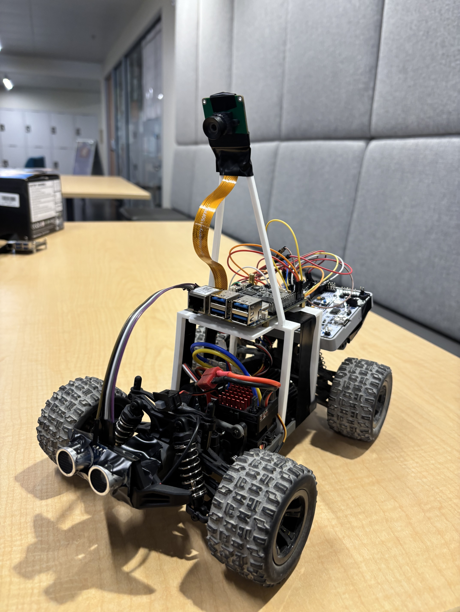
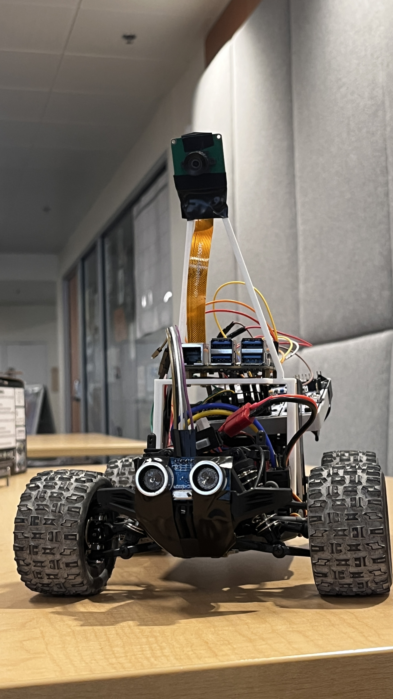
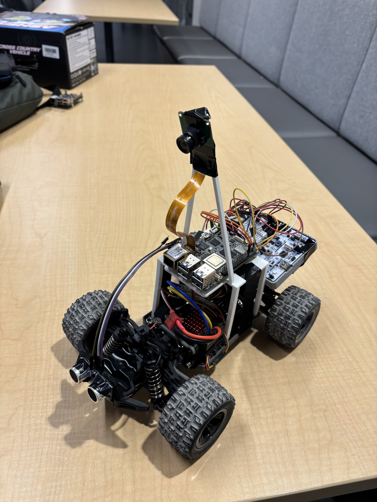
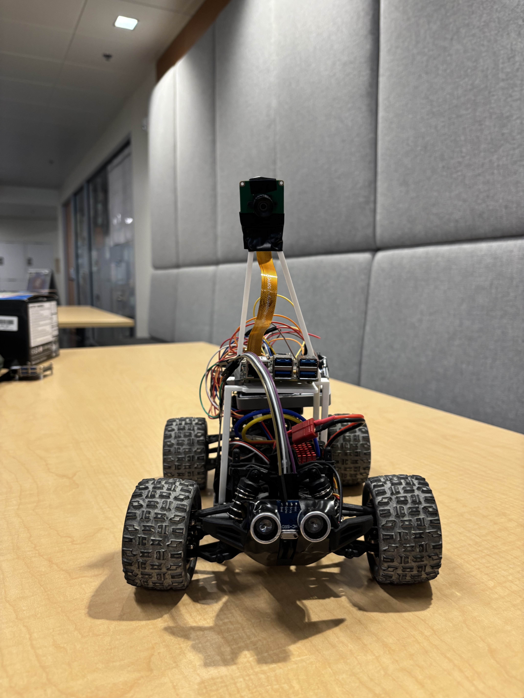

# PacerBot

<table align="center" cellpadding="8" cellspacing="0" style="width: 100%;">
  <tr>
    <td align="center"></td>
    <td align="center"></td>
  </tr>
  <tr>
    <td align="center"></td>
    <td align="center"></td>
  </tr>
</table>

PacerBot is an autonomous RC vehicle designed to help runners maintain a target pace.

The project combines embedded firmware, Linux software, computer vision, real-time control, and a web-based interface to create a portable pacing system for running workouts.

## Motivation

It can be difficult for runners to hold a consistent pace during workouts.

Running watches display pace information, but runners must still repeatedly check their watch and adjust their speed.

Professional pacing systems such as WaveLight exist, but they are expensive and only available at certain tracks and events.

PacerBot was built as a lower-cost, portable pacing system that can autonomously drive around a track while maintaining a target pace.

## System Architecture

PacerBot splits processing between a BeagleY-AI and an STM32. The BeagleY-AI handles high-level control, computer vision, telemetry, and the user interface, while the STM32 handles real-time motor control and sensor acquisition.

```text
                         BeagleY-AI
┌─────────────────────────────────────────────────────┐
│                                                     │
│  React Web UI                                       │
│       ↓ HTTP                                        │
│  FastAPI Backend                                    │
│       ↓ Unix Domain Socket / JSON-RPC               │
│  RobotController (C++)                              │
│       ├── High-level robot control                  │
│       ├── Robot state management                    │
│       ├── Telemetry                                 │
│       └── UART communication                        │
│                                                     │
│  IMX219 Camera                                      │
│       ↓                                             │
│  Vision Pipeline                                    │
│       ├── Camera processing                         │
│       ├── Lane detection                            │
│       └── Autonomous steering                       │
│                                                     │
└─────────────────────────┬───────────────────────────┘
                          │ UART
                          ↓
                        STM32
                          │
              ┌───────────┼───────────┐
              │           │           │
         Motor Control   Sensors    Safety
              │
             PWM
              ↓
      ESC + Servo + Drive Motor
```

## Software Architecture

The web interface and robot controller run on the BeagleY-AI.

The React frontend communicates with a FastAPI backend over HTTP. FastAPI acts as a thin API layer and forwards robot commands to the C++ `RobotController` service using JSON-RPC over a Unix Domain Socket.

```text
React Web UI
     ↓ HTTP
FastAPI
     ↓ JSON-RPC / Unix Domain Socket
RobotController (C++)
     ↓ UART
STM32
```

This separation keeps hardware and robot-control logic out of the web server while allowing multiple user interfaces to communicate with the same controller.

## Repository Structure

```text
linux/
  Linux host software
  - RobotController
  - UART communication
  - FastAPI backend
  - React web interface
  - Computer vision

stm32/
  STM32 firmware
  - Motor and steering control
  - PID control
  - Sensor drivers
  - Safety logic
```

## Hardware Used

### Core Components

- BeagleY-AI SBC
- STM32F411RE microcontroller
- IMX219 CSI camera
- 1/10 scale RC car chassis
- RC battery
- Brushed ESC
- Steering servo
- Drive motor
- IMU
- GPS receiver
- Ultrasonic distance sensor

## Development Tools

- C / C++
- Python
- React
- FastAPI
- CMake
- Ninja
- GCC / Clang
- arm-none-eabi toolchain
- STM32CubeMX
- OpenCV
- GStreamer
- Unix Domain Sockets
- Git

## Web Control Interface

PacerBot includes a web-based interface for controlling the robot and viewing live telemetry.

The interface currently supports:

- setting a target pace
- starting and stopping the robot
- viewing current and target speed
- viewing speed error and robot state
- monitoring the connection to the RobotController

The interface is being designed to work on both desktop and watch-sized displays, with separate panels for controls, settings, and workout statistics.

## UART Communication

The BeagleY-AI and STM32 communicate over UART using lightweight command and telemetry packets.

The protocol is used for:

- start/stop commands
- throttle and speed control
- steering commands
- GPS data
- IMU data
- ultrasonic distance measurements
- robot telemetry and status messages

Sensor telemetry received from the STM32 can be forwarded through the RobotController and FastAPI backend to connected user interfaces.

## Current Status

- ✅ Bidirectional UART communication between BeagleY-AI and STM32
- ✅ ESC and steering control operational
- ✅ Manual control over UART
- ✅ GPS, IMU, and ultrasonic sensor integration
- ✅ C++ RobotController service
- ✅ Unix Domain Socket IPC between FastAPI and RobotController
- ✅ FastAPI control and telemetry API
- ✅ React web control interface
- 🔄 Web dashboard refinement
- 🔄 Vision pipeline development
- 🔄 Autonomous lane following

## Roadmap

### Autonomous Navigation

- Computer vision lane detection
- Autonomous steering and track following
- Closed-loop pace control

### GPS Mapping & Statistics

- Stream GPS coordinates from the STM32 over UART
- Display the robot's route on a live map
- Track workout distance and elapsed time
- Calculate current and average pace
- Store workout statistics

### Watch Interface

- Watch-optimized responsive web interface
- Swipeable control and telemetry panels
- Home/status panel
- Pace controls
- Live workout statistics
- GPS route display
- Native watchOS application using the existing FastAPI interface

### Safety System

- Ultrasonic obstacle detection
- Camera-based object detection
- Combined vision and distance-based automatic stopping
- User-triggered emergency stop from the web/watch interface
- Fail-safe handling for communication loss

