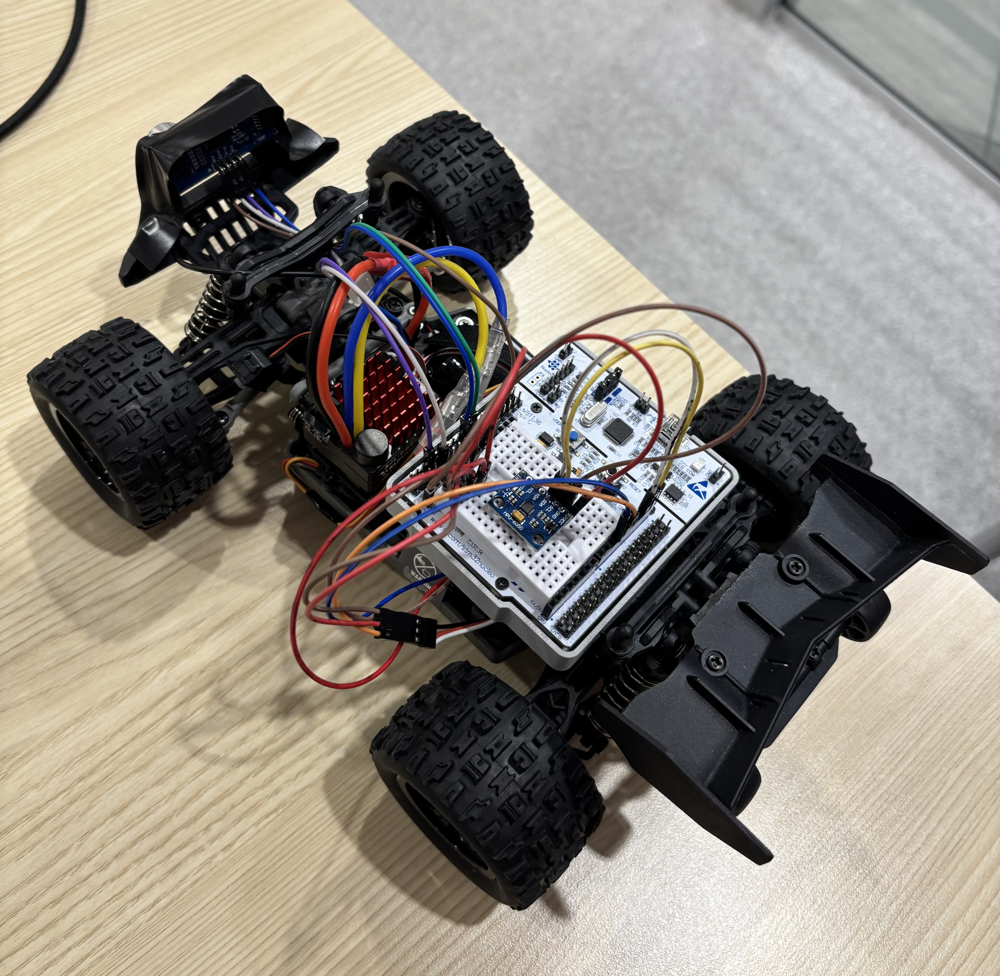

# PacerBot

<p align="center">
  
</p>

PacerBot is an autonomous RC vehicle designed to help runners maintain a target pace.

## Motivation

It can be difficult for runners to hold a consistent pace during workouts. Watches can display pace, but runners still need to constantly check and react.

Professional pacing systems such as WaveLight exist, but they are expensive and only available at certain tracks and events.

PacerBot was built as a lower-cost, portable pacing system that can autonomously drive around a track while maintaining a target pace.

## System Architecture

```text
Camera
  ↓
Radxa
  - lane detection
  - steering/speed decisions
  - telemetry 
  ↓ UART
STM32
  - PID control
  - PWM generation
  - sensor integration
  - safety
  ↓
ESC + servo + motors
```

## Repository Structure

```text
linux/      Host-side control and hardware abstraction for local testing
  app/      Main executable and state machine logic
  comm/     UART communication stack
  hal/      Host-side hardware abstraction and mocks

stm32/      STM32 firmware (FreeRTOS + HAL + motor control)
  Firmware/ Project modules mirrored from host structure
  Core/     STM32CubeMX-generated core startup/HAL integration

web/        API and frontend experiments
```

## Hardware Used

### Core Components

- Radxa Zero 3W SBC
- STM32F411RE microcontroller
- 1/10 scale RC car chassis
- Brushed ESC
- Steering servo
- Drive motor
- Camera module for lane detection
- IMU + wheel encoder sensors
- Battery 
- Distance sensor

## Development Tools

- CMake
- Ninja
- GCC / Clang
- arm-none-eabi toolchain
- STM32CubeMX

## Current Status

- Host-side C++ stack and UART manager are in active development.
- STM32 project is configured with CubeMX + CMake and auto-flash post-build.
- Web/API workspace exists but is currently secondary to control firmware.
- ESC and steering control operational on STM32 hardware.

## UART Communication

The Radxa and STM32 communicate over UART using lightweight command packets for:

- start/stop commands
- throttle/speed control
- steering commands
- telemetry and status messages

